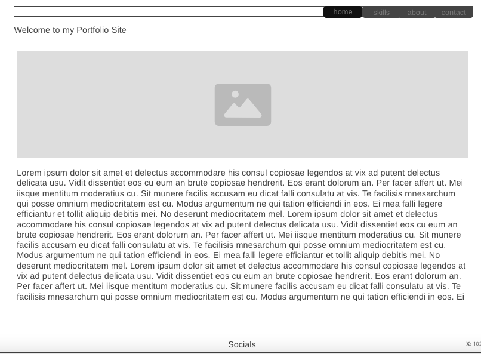

# My Portfolio Website

## 🌟 Overview
This is a personal **portfolio website** designed to showcase my skills, projects, and experience in programming and web development. The site features a modern, responsive layout with interactive sections highlighting my expertise in front-end and back-end development.

## ✨ Features
- **Navigation Bar:** Includes a logo and menu links aligned to the right.
- **Skills Section:** Describes my experience with programming languages and frameworks.
- **About Me:** Provides insights into my background and interests.
- **Projects & Experience:** Showcases past work and contributions.
- **Contact Links:** Social media icons for easy connection.

## 🖼️ Wireframe
Below is a simplified wireframe representation of the layout:

## 🚀 Technologies Used
- **HTML5 & CSS3** (Semantic structuring & styling)
- **JavaScript (Vanilla JS)** (Interactive elements)
- **Font Awesome** (Icons for social media)
- **Flexbox** (Responsive layout optimization)

## 📩 Contact Me
Feel free to reach out via:
- **Email:** [byzantium1988@google.com]
- **GitHub:** [github.com/Askeran17]

